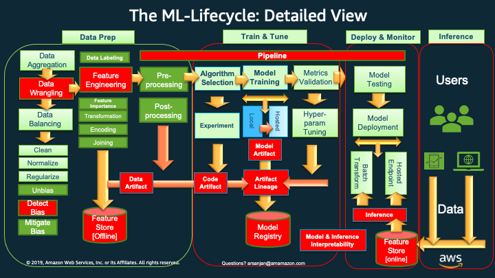

# Architect and Build an End to End Workflow for Auto Claim Fraud Detection with SageMaker Services (한국어화)

본 핸즈온은 AWS AIML blog에 소개된
[Architect and build the full machine learning lifecycle with AWS: An end-to-end Amazon SageMaker demo](https://aws.amazon.com/ko/blogs/machine-learning/architect-and-build-the-full-machine-learning-lifecycle-with-amazon-sagemaker/)의 공식 예제 코드를 한국어화한 코드입니다.

- [Notebook 0](0-AutoClaimFraudDetection.ipynb): Overview, Architecture, and Data Exploration
- [Notebook 1](1-data-prep-e2e.ipynb): Data Preparation, Ingest, Transform, Preprocess, and Store in SageMaker Feature Store
- [Notebook 2](2-lineage-train-assess-bias-tune-registry-e2e.ipynb) and [Notebook 3](3-mitigate-bias-train-model2-registry-e2e.ipynb) : Train, Tune, Check Pre- and Post- Training Bias, Mitigate Bias, Re-train, and Deposit the Best Model to SageMaker Model Registry
- [Notebooks 4](4-deploy-run-inference-e2e.ipynb) : Load the Best Model from Registry, Deploy it to SageMaker Hosted Endpoint, and Make Predictions
- [Notebooks 5](5-pipeline-e2e.ipynb): End-to-End Pipeline - MLOps Pipeline to run an end-to-end automated workflow with all the design decisions made during manual/exploratory steps in previous notebooks.

## The ML Life Cycle: Detailed View

빨간색 상자와 아이콘은 프로덕션 중심(연구 중심과 비교) 및 확장 가능한 ML 수명주기에서 포함하고 실행하는 것이 중요하다고 간주되는 비교적 새로운 개념과 작업을 나타냅니다.

이러한 최신 수명주기 작업과 이에 상응하는 AWS 서비스 및 기능은 다음과 같습니다.

1. [*Data Wrangling*]() : 데이터 클린징, 정규화, 변환 및 인코딩은 물론 데이터셋 조인을 위한 AWS Data Wrangler입니다. 데이터 랭글러의 출력은 SageMaker Processing, SageMaker Pipelines, SageMaker Feature Store 또는 pandas가 있는 일반적인 Python 스크립트와 함께 작동하도록 생 된 코드입니다.
    1. 피쳐 엔지니어링은 항상 수행되었지만, 이제 AWS Data Wrangler를 통해 GUI 기반 도구를 사용하여 이를 수행하고 수명주기의 다음 단계를위한 코드를 생성할 수 있습니다.
2. [*Detect Bias*](): 데이터 준비 또는 훈련에서 AWS Clarify를 사용하여 사전 훈련 및 사후 훈련 편향을 감지할 수 있으며, 결국 추론 시간에 추론에 대한 해석 가능성 및 설명 가능성을 제공합니다 (예 : 예측)
3. [*Feature Store [Offline]*](): 모든 피쳐 엔지니어링, 인코딩 및 변환을 완료하면 AWS Feature Store에서 오프라인으로 피쳐를 표준화하여 모델 훈련을 위한 입력 피쳐로 사용할 수 있습니다.
4. [*Artifact Lineage*](): AWS SageMaker의 아티팩트 계보 기능을 사용하여 모든 아티팩트 (데이터, 모델, 매개 변수 등)를 훈련된 모델과 연결하여 모델 레지스트리에 저장할 수 있는 메타데이터를 생성할 수 있습니다.
5. [*Model Registry*](): AWS Model Registry는 모델 생성 프로세스에 포함하기로 선택한 모든 아티팩트 주변의 메타데이터를 모델 레지스트리에 모델 자체와 함께 저장합니다. 나중에 사람의 승인을 통해 모델이 프로덕션에 들어가는 것이 좋다는 것을 알 수 있습니다. 이는 배포 및 모니터링의 다음 단계로 넘어갑니다.
6. [*Inference and the Online Feature Store*](): 실시간 추론을 위해 생성한 온라인 AWS 피쳐 저장소를 활용하여 새로운 수신 데이터로 모델을 제공하기 위해 한 자릿수 밀리초(ms)의 낮은 지연 시간과 높은 처리량을 얻을 수 있습니다.
7. [*Pipelines*]():  수명주기의 다양한 옵션을 실험하고 결정한 후 (피쳐에 적용하기 위햔 변환, 데이터의 불균형 또는 편향, 훈련할 알고리즘 선택, 최고의 성능 메트릭을 제공하는 하이퍼 파라메터 등) 이제 SageMaker Pipelines를 사용하여 수명주기 전반에 걸쳐 다양한 작업을 자동화할 수 있습니다.
    1. 이 핸즈온에서는 AWS Data Wrangler의 출력으로 시작하여 훈련된 모델을 모델 레지스트리에 저장하는 것으로 끝나는 파이프 라인을 보여줍니다.
    2. 일반적으로 데이터 준비를 위한 파이프라인, 모델 레지스트리까지 훈련용 파이프라인, 추론용 파이프라인, 모델 드리프트 및 데이터를 감지하기 위해 SageMaker Monitor를 사용한 재훈련용 파이프 라인이 있을 수 있습니다. AWS Lambda 함수를 사용하여 드리프트하고 재훈련을 트리거합니다.